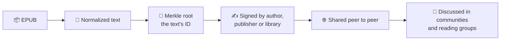
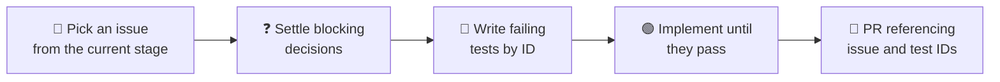

# 📚 Agora

A decentralized network for sharing books and articles and discussing them. Anyone can check that a quote really appears in a book, or that an author really signed it, without a central authority.

> 🚧 **Status:** design stage, working toward the proof of concept. There is no runnable code yet. See [where we are](#-where-we-are).

## ✨ How it works



- 📘 **Books are identified by their text, not their file.** Each writing has three levels: the Work, the Edition (its text) and the File (its exact bytes). Discussions attach to the writing, so two copies of the same book share one conversation.
- 🔏 **Quotes can be proven.** The text is normalized, split into paragraphs and hashed into a Merkle tree. One paragraph plus a short chain of hashes proves a quote, without sharing the whole book. A forged quote doesn't verify.
- 🤝 **Authenticity comes from signatures and trust.** Authors, publishers, estates or libraries sign a text's root hash. Keys can be rotated, signatures are timestamped, and readers' attestations add weight.
- 💬 **Discussion lives next to the text.** Open communities, reading groups, posts and comment threads are all signed records anchored to a writing.
- 📱 **Peer to peer, without the jargon.** Nodes talk over Iroh, and QR codes and short links hide hashes and keys from users.

The reasoning is in [docs/DESIGN.md](docs/DESIGN.md) and the technical structure in [docs/ARCHITECTURE.md](docs/ARCHITECTURE.md).

## 🧰 Stack

|     | Piece                             | Role                                                               |
| --- | --------------------------------- | ------------------------------------------------------------------ |
| 🐍  | `agora` (Python)                  | App logic and validation                                           |
| 🦀  | `agora_core` (Rust, PyO3/maturin) | Exposes Iroh (iroh-blobs, iroh-gossip, iroh-docs) to Python        |
| 🧪  | pytest                            | Every test layer, from pure functions to multi-node networks       |
| 📦  | EPUB                              | The core format; other formats come later through an adapter layer |

## 🗺️ Where we are

Development runs in three stages, each a milestone. All work is done test-first.


### 🏔️ Epics

| Epic                                                                                                       | Scope                                                                                |
| ---------------------------------------------------------------------------------------------------------- | ------------------------------------------------------------------------------------ |
| [#21 · POC · Prove the core flow end to end](https://github.com/mayaberries/agora/issues/21)               | Text identity, quote proofs, basic signing, two nodes sharing a book and a post      |
| [#22 · MVP · Ship a usable network for public communities](https://github.com/mayaberries/agora/issues/22) | Key rotation, attestations, communities and reading groups, QR sharing, first client |
| [#23 · v1.0 · Harden for a public release](https://github.com/mayaberries/agora/issues/23)                 | Private groups, reputation, resilience, performance, other formats, multiplatform    |
| [#1 · Tests · Implement the Agora test plan](https://github.com/mayaberries/agora/issues/1)                | Test infrastructure, corpus, every test suite, CI and reporting                      |

### 🔗 Issue shortcuts

| View               | Open issues                                                                                         | Milestone                                                |
| ------------------ | --------------------------------------------------------------------------------------------------- | -------------------------------------------------------- |
| 🏔️ All epics      | [label:epic](https://github.com/mayaberries/agora/issues?q=is%3Aissue+is%3Aopen+label%3Aepic)       |                                                          |
| 🧪 POC             | [label:poc](https://github.com/mayaberries/agora/issues?q=is%3Aissue+is%3Aopen+label%3Apoc)         | [POC](https://github.com/mayaberries/agora/milestone/1)  |
| 🚀 MVP             | [label:mvp](https://github.com/mayaberries/agora/issues?q=is%3Aissue+is%3Aopen+label%3Amvp)         | [MVP](https://github.com/mayaberries/agora/milestone/2)  |
| 🏁 v1.0            | [label:v1.0](https://github.com/mayaberries/agora/issues?q=is%3Aissue+is%3Aopen+label%3Av1.0)       | [v1.0](https://github.com/mayaberries/agora/milestone/3) |
| ✅ Testing          | [label:testing](https://github.com/mayaberries/agora/issues?q=is%3Aissue+is%3Aopen+label%3Atesting) |                                                          |
| ⚙️ CI              | [label:ci](https://github.com/mayaberries/agora/issues?q=is%3Aissue+is%3Aopen+label%3Aci)           |                                                          |
| 📋 Everything open | [all open issues](https://github.com/mayaberries/agora/issues?q=is%3Aissue+is%3Aopen)               |                                                          |
|                    |                                                                                                     |                                                          |

Stage labels also appear on testing issues, so a stage filter shows the development work together with the tests it must pass.

## 📁 Repository layout

```
src/         source code (empty until the POC starts)
tests/       test suites (layout in docs/TESTING.md §7)
data/        data files (empty for now)
docs/        design, architecture, roadmap and test plan
SETUP.md     contributor setup: GitHub token, direnv, gh, Claude Code
CLAUDE.md    guidance for Claude Code in this repo
```

## 🚀 Getting started

There is nothing to build or run yet. Build and test commands will be added here when the POC scaffold lands ([#24](https://github.com/mayaberries/agora/issues/24)); it will need Python, a Rust toolchain and maturin.

To set up a clone for contributing (GitHub token, `direnv`, `gh`, Claude Code with the GitHub MCP server), follow [SETUP.md](SETUP.md).

## 🤝 Contributing

Work is tracked in GitHub issues, grouped into the POC, MVP and v1.0 milestones, and done test-first:



1. Pick a development issue from the current milestone.
2. Settle any blocking decision in its linked testing issue. Don't assume an answer in code.
3. Write the failing tests, named by their IDs, then implement until they pass.
4. Open a PR that references the issue and the test IDs.

⚠️ Behaviour without a test ID doesn't get built; add the case to its testing issue first. The full workflow is in [docs/ROADMAP.md](docs/ROADMAP.md). Development uses public-domain and Creative Commons books only.

## 📖 Documentation

| Document | What it covers |
| --- | --- |
| 💡 [docs/DESIGN.md](docs/DESIGN.md) | The problem, the ideas behind Agora, and how trust works |
| 🏗️ [docs/ARCHITECTURE.md](docs/ARCHITECTURE.md) | Layers, technical decisions, records and the domain model |
| 🗺️ [docs/ROADMAP.md](docs/ROADMAP.md) | The POC, MVP and v1.0 stages, their issues, and the test-driven workflow |
| 🧪 [docs/TESTING.md](docs/TESTING.md) | Testing rules: layers, markers, corpus, CI stages, reporting, exit criteria |
| 🛠️ [SETUP.md](SETUP.md) | Setting up a fresh clone on macOS, Linux or Windows |

## ⚖️ License

No license has been chosen yet.
