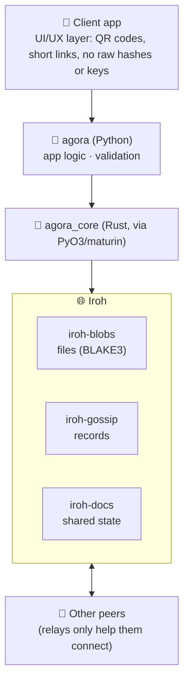
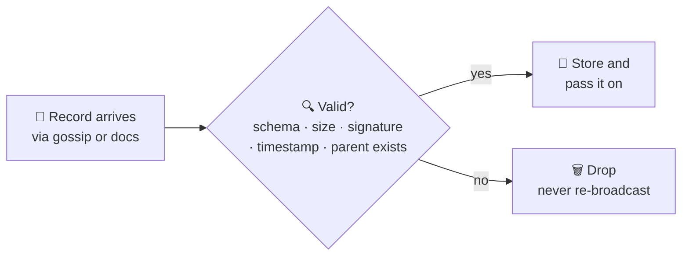
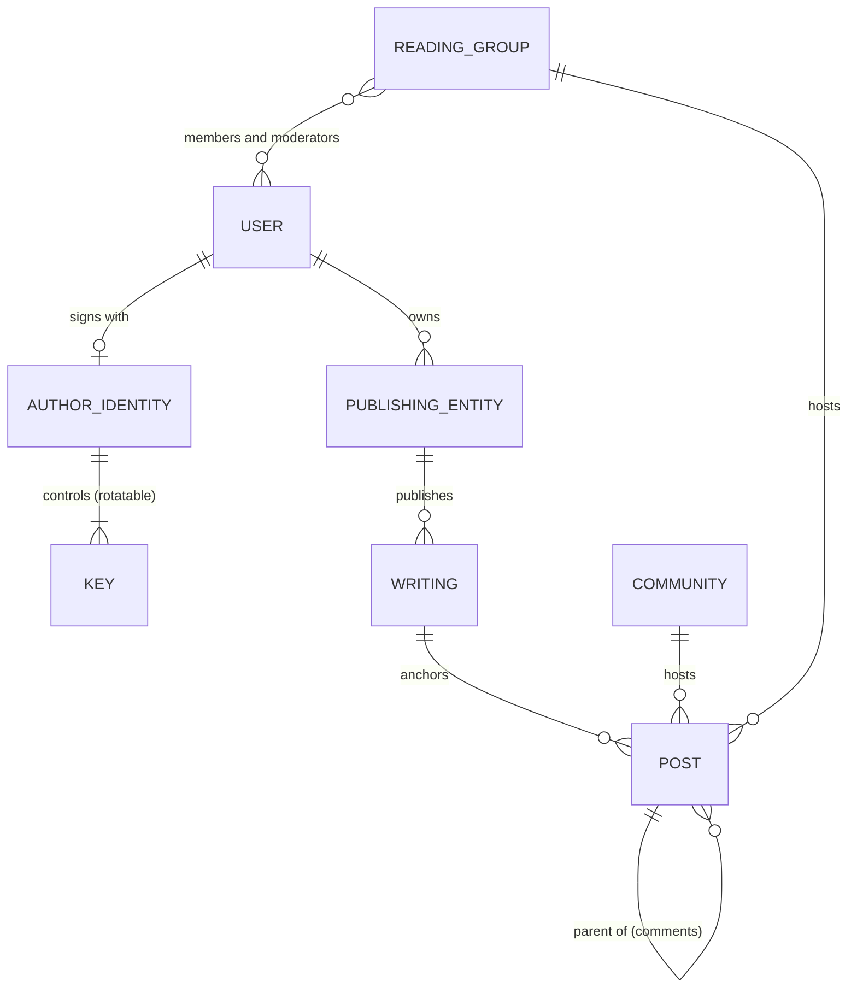

# 🏗️ Agora Architecture

> How Agora is built: the layers, the network, the records nodes exchange, and the domain model. Why it is built this way is in [DESIGN.md](DESIGN.md).

## 🧅 Layers

## ⚙️ Technical decisions

- **Network: Iroh.** Nodes connect directly using tickets; relays only help peers reach each other and never hold authority. We use three Iroh protocols:
  - **iroh-blobs** stores and transfers files, verified by their BLAKE3 hash.
  - **iroh-gossip** spreads new posts, comments and other records to interested peers.
  - **iroh-docs** syncs shared state that several peers write to.
- **Code: Python on top of a Rust core.** The official Iroh Python bindings only cover the basics (endpoints, connections, tickets), not blobs, gossip or docs. A thin Rust crate, `agora_core`, exposes what we need to Python through PyO3/maturin. App logic and validation live in the Python package `agora`.
- **Everything is a signed record.** Writings, editions, posts, comments, attestations, memberships and moderation actions are signed, content-addressed records. Every node validates every record it receives; the network itself enforces no rules.
- **Private reading groups are encrypted.** Only members can read their content, and removed members can't read anything posted after they leave. The encryption scheme is still open.
- **Testing:** Python with pytest, from pure functions up to multi-node networks and malicious peers. See [TESTING.md](TESTING.md), and [ROADMAP.md](ROADMAP.md) for the stages.

## 📨 Life of a record

Every node checks every record it receives. Nothing is trusted because of where it came from.

## 🏛️ Domain model

In this first stage, we can allow a new user to have their own publisher/library. Eventually we can work towards the trustability of each entity. So, besides being a new user, you can create a new publishing house, book or blog (one user to many publishing entities relationship and one publisher to many published works).

So, when it comes to the relationships of the entities among the network:

- A user. A plain old registered user but traduced to a decentralized network capabilities.
- An author identity that works similar to e-signatures managed by mexican SAT, Cryptocurrency or doc signature platforms.
- A publishing entity: being this a library, an editorial, a blog or a zine.
- Writings: an article, a book, a blog post, etc.
- A community, around a topic, a book, etc. Similar to Reddit, but without capability to claim ownership of the topic.
- A close reading group/subreddit/substack, again, similar to reddit, but here we can claim it as a public or private one, have moderators, ask for permission to join or join openly.
- Posts for these communities. With title, content, author, etc. We can make use of Markdown for better legibility and not reinventing the wheel. Something similar as what Github makes with issues. Also, since this is not made specifically as an isolated social network, the posts must need a writing to anchor to.
- Comments. Same as the posts. These can work as the same entity but nested via it's "am I a comment or a post" and the hierarchy: "where am I in the thread? Who am I responding to? another comment, a post". This way we can create something like a tree where I don't need as a posted entity the whole conversation but if you link all the interlinked entities, you're able to fill a whole comment section.

Posts and comments are one entity type: each one knows only its parent, and a full thread is rebuilt by following those links.
