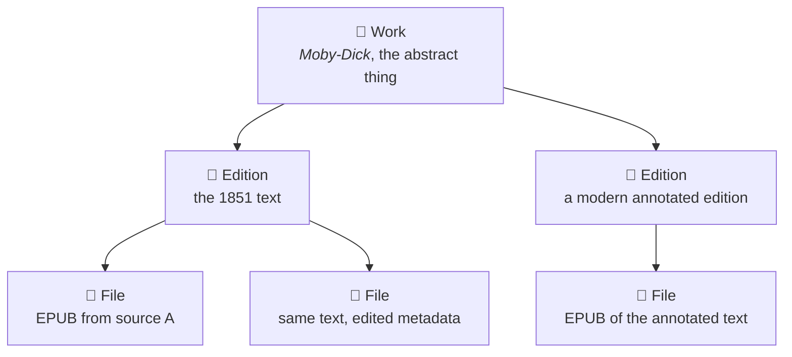
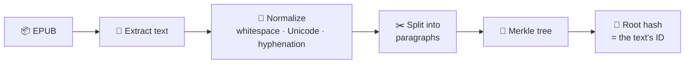
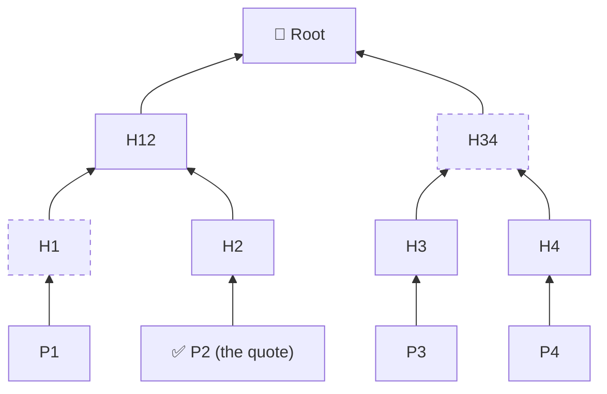
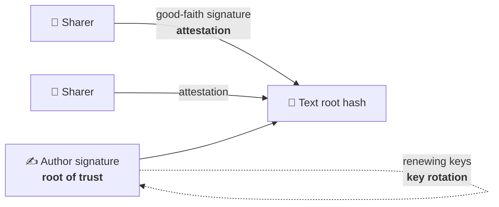
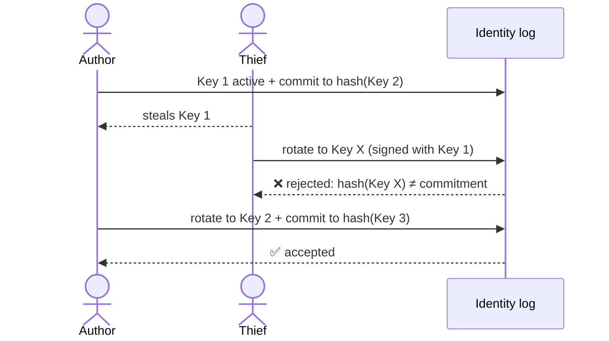
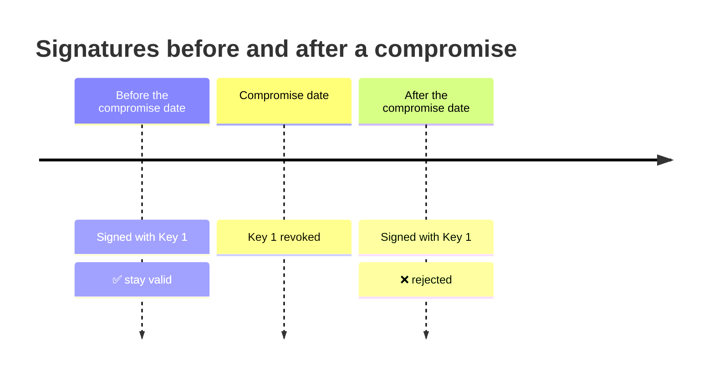

# 📚 Agora Design

> The problem Agora solves, the ideas behind it, and how trust works. How it is built lives in [ARCHITECTURE.md](ARCHITECTURE.md); the build plan in [ROADMAP.md](ROADMAP.md).

## 💡 The idea

Agora is the codename for a decentralized application to share books, articles and discussion around them without the need of a central authority to certify publishings. The idea is doing something similar to what p2p networks like torrents or source control tools like github do: a hash as an ebook/document identifier.

It should be a network that allows you to not only share documents but also grow a discussion around them. For example, if people are discussing the same book but different people are discussing different editions or if someone might want to forge a quote inside a book, so we’re capable of certifying the originality of a work in a decentralized way. We're gonna be using **content addressing**, like IPFS, BitTorrent, and Git already use to identify data. 

## 🧩 A hash identifies bytes, not books

**Challenge to solve: a hash identifies bytes, not books.** Two EPUBs of the same edition, or the same file with edited metadata or a different cover, produce completely different hashes. If you key discussions on file hashes, conversations about the same book splinter. The usual fix, borrowed from library science (FRBR), is a hierarchy:

- **Work**: _Moby-Dick_ as an abstract thing, identified by an assigned ID or a community-agreed record.
- **Edition**: the 1851 text vs. a modern annotated edition (ISBN, or a hash of the normalized text).
- **File**: the exact bytes (a BLAKE3 hash, the content address Iroh uses).

Discussions attach to the Work or Edition, never to a single File, so new copies of the same text join the existing conversation.

## 🔏 Hash the text, not the file

**For verification, hash the text, not the file.** Extract the text, normalize it (whitespace, Unicode, hyphenation), split it into paragraphs, and build a **Merkle tree** over them. The root hash identifies the text. Anyone can then prove a quote appears in it by showing that one paragraph plus a short chain of hashes, without sharing the whole book, which also helps with copyright. A forged quote simply won't verify against the root.

How a quote proof works: to prove paragraph P2, you share P2 plus the two hashes it needs (H1 and H34). Anyone can rebuild the root and compare.

## 📖 First content and formats

We're gonna be starting to develop and test with creative commons or public domain books, to make this easy. The idea is by now to allow anyone to load books on the network and keep record that they registered it via this hashing. The user should upload an epub and declare authorship and/or that they published it. If you register an already available book like Moby Dick, we should save on the network the metadata, either via automatically borrowing it from the book or by filling it manually: Author, ISBN and editorial (if it's not exclusively published on the network), year, etc.

On a secondary layer we can allow them to upload other open formats like OEB, MUBI or even TXT but it should be as I mention a different layer, business logic or responsibility of the system. The core should be working specifically with EPUB.

## 🤝 The challenge is trust, not cryptography

If the author themselves decides to publish their own work, we should give the capability to give it their signature. That way we can protect the publicly available work from forgery. **The challenge is trust, not cryptography.** A hash proves "this matches that." It doesn't prove "that" is the authentic original. Someone could hash a doctored edition first. Decentralized ways to anchor authenticity:

- **Publisher  and/or author signatures** on the root hash, which is the strongest option when available.
- **Timestamping** (e.g. OpenTimestamps on Bitcoin) to prove a version existed at a given date, so earlier versions win disputes.
- **Attestations**: many independent people who own physical or purchased copies sign that a root matches their copy, like a web of trust.
- **Fuzzy hashes** (simhash, minhash) to detect that two texts are near-identical variants and link editions automatically.

## 🧱 Pieces we build on

**Pieces we build on:** Iroh for the network (see [ARCHITECTURE.md](ARCHITECTURE.md)), OpenTimestamps for anchoring signatures in time, and the W3C Web Annotation standard (used by Hypothesis) for anchoring comments to exact passages with "text quote selectors" that survive formatting changes.

## 📱 For every device and every audience

We want to make this network available in most devices and for most audiences, contrary to some tools for torrents and cryptocurrency that require a certain level of expertise to manage it. Thus, we want to create both a network layer and a UI/UX layer that encapsulate all the levels of complexity. The network layer runs on Iroh, which gives us multiplatform support. Then we can build applications on top of it that makes the adoption smooth. We can give different types of capabilities to share works, discussion groups, profiles, etc via different tools like QR or simplified hashes via links. That way we can hide the complexity that makes it hard to adopt technologies like Tor or Crypto (huge tor links or wallet identifiers instead of domains or CLABEs/Card Numbers).

## ✍️ Author signatures and stolen keys

The author’s signature can be a good way to keep verification intact. If you publish, you get to sign the document, and when someone shares it, you get to give that document your good faith signature. In a way someone can still steal the author’s signature, but also, you could create a system that renews them. The author signature is the **root of trust**, the sharers' good-faith signatures are **attestations**, and "renewing" is **key rotation**. 

The hard part is stolen keys:

**Separate identity from keys.** The author shouldn't _be_ a key; they should be an identity that _controls_ keys. Decentralized Identifiers (DIDs) work this way: the author's identity document lists which keys are currently valid, and they can swap keys without losing their identity or reputation.

**Pre-rotation** handles theft well. When you create your current key, you also commit to the hash of your _next_ key, kept offline. If your current key is stolen, the thief can't rotate it because they don't have the pre-committed next key, but you can. KERI (Key Event Receipt Infrastructure) is built around this idea.

**Rotation needs timestamps, or it breaks old signatures.** If a key is revoked, what happens to everything it signed? You don't want the author's whole bibliography to become invalid. The answer is to anchor each signature in time (OpenTimestamps or a public append-only log). Then the rule becomes: signatures made _before_ the compromise date stay valid, and anything signed after is rejected. A thief's forgeries all fall after the revocation, or in a small window you can dispute.

**Transparency logs** make silent forgery hard. If every signature is published to a public, append-only log (like Certificate Transparency for websites), the author can monitor it and immediately spot "I never signed that."

### 🛡️ For extra security

- **Threshold signatures**: the author splits signing power across devices or trusted people (e.g. 2 of 3), so one stolen key isn't enough.
- **Social recovery**: if the author loses everything, a group of designated people can jointly authorize a new key.

**Sharer attestations need weight.** A signature from a random new account is worth little, since anyone can create a thousand of them. Attestations are more useful when they come from people with history in the network, or who prove they own a copy, so the "good faith" layer is really a reputation system on top of cryptography.

One edge case: what about dead authors, anonymous authors, or works published before the system existed? There, the publisher, an estate, or a library could act as the signer, which suggests our network should allow multiple kinds of root signers with different trust levels.

## 🏛️ Entities

The relationships between users, publishing entities, writings, communities and posts are described in [ARCHITECTURE.md](ARCHITECTURE.md#-domain-model), with a diagram.
